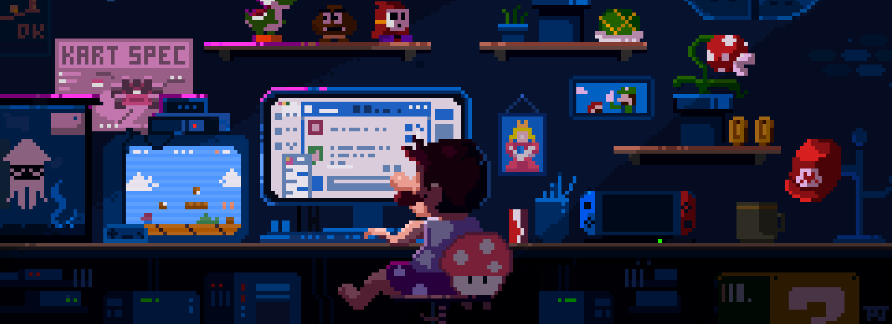

<!-- Animated Wave Header -->

  

<!-- Typing Animation with Premium Font -->

  

<!-- Elegant Stats Section -->

  

    
    &nbsp;&nbsp;
    
    &nbsp;&nbsp;
    
    &nbsp;&nbsp;
    
  

<!-- Social Links with Hover Effects -->

   
  
  
  
  
  

 

<!-- Animated About Section -->

   
  
   

 
<h2 align="center">
   
  &nbsp;About Me&nbsp;
  
</h2>

  
  
 

🚀 **Software Engineer** at <a href="https://metaforms.ai" target="_blank"><strong>metaforms</strong></a> building **real-time, scalable systems**

🔥 Passionate about **low-latency WebSockets**, **event-driven architectures**, and **distributed systems**

💡 Worked with **gRPC**, **Protocol Buffers**, and **microservices communication**

🛠️ Creating **MCP servers** and integrating **AI-powered solutions**

📊 Turning **data into insights** with **real-time analytics**

 

<!-- Tech Arsenal Section -->
<h2 align="center">
   
  Tech Arsenal
  
</h2>

  
### Core Languages

  
  &nbsp;&nbsp;
  
  &nbsp;&nbsp;
  
  &nbsp;&nbsp;
  
  &nbsp;&nbsp;
  

### Frontend Libraries & Frameworks

  
  &nbsp;&nbsp;
  
  &nbsp;&nbsp;
  
  &nbsp;&nbsp;
  
  &nbsp;&nbsp;
  
  &nbsp;&nbsp;
  

### Backend Powerhouse

  
  &nbsp;&nbsp;
  
  &nbsp;&nbsp;
  
  &nbsp;&nbsp;
  
  &nbsp;&nbsp;
  
  &nbsp;&nbsp;
  
  &nbsp;&nbsp;
  

### Real-Time & Communication

  
  &nbsp;
  
  &nbsp;
  
  &nbsp;
    
    &nbsp;&nbsp;
  

### Data & Infrastructure

  
  &nbsp;&nbsp;
  
  &nbsp;&nbsp;
  
  &nbsp;&nbsp;
  
  &nbsp;&nbsp;

 

### DevOps & Cloud

  
  &nbsp;&nbsp;
  
  &nbsp;&nbsp;
  
  &nbsp;&nbsp;
  

 

  
  &nbsp;&nbsp;
  
  &nbsp;&nbsp;
  

### AI & Innovation

  
  &nbsp;&nbsp;
  

 

  
  &nbsp;&nbsp;
  

 

<!-- GitHub Stats with Premium Theme -->
<h2 align="center">
  
  GitHub Analytics
  
</h2>

<!-- Stats Cards in Grid -->

  <table>
    <tr>
      <td></td>
      <td></td>
    </tr>
    <tr>
      <td colspan="2" align="center">
        
      </td>
    </tr>
  </table>

<!-- Snake Animation -->
<h2 align="center">
  
  Contribution Snake
  
</h2>

  <picture>
    <source media="(prefers-color-scheme: dark)" srcset="./outputs/github-contribution-grid-snake-dark.svg" />
    <source media="(prefers-color-scheme: light)" srcset="./outputs/github-contribution-grid-snake.svg" />
    
  </picture>

<!-- Activity Graph -->

  

 

<!-- Trophy Section -->
<h2 align="center">
  
  GitHub Trophies
  
</h2>

  

<!-- Footer with Wave -->

    
  

<!-- Hidden Metrics -->
<!--START_SECTION:waka-->
<!--END_SECTION:waka-->

